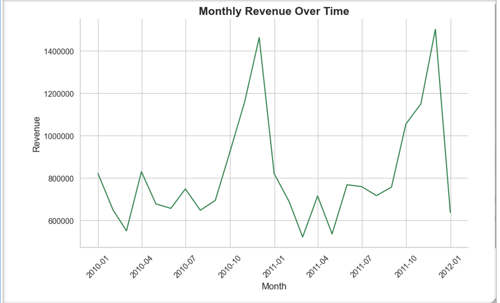
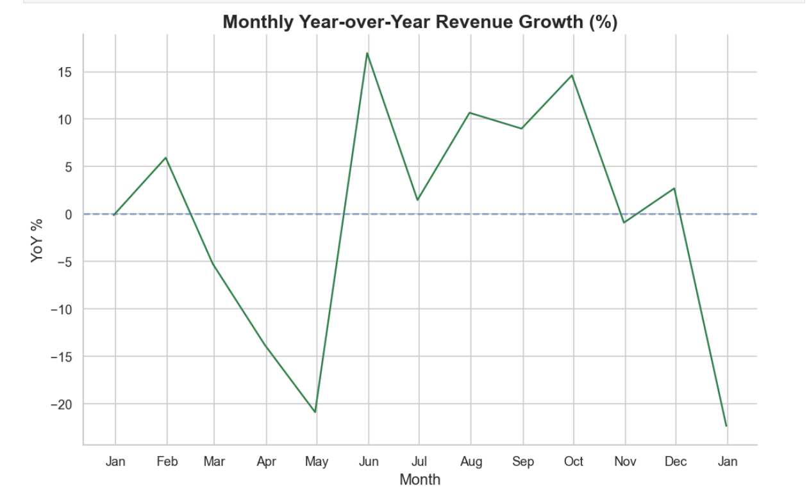

# Online retail analysis
## Table of Contents

- [Project Overview](#project-overview)
- [Dataset](#dataset)
- [Tools & Technologies](#tools--technologies)
- [Methodology](#methodology)
- [Key Insights](#key-insights)
- [Business Recommendations](#business-recommendations)
- [Limitations](#limitations)
- [How to Run](#-how-to-run)
  
## Project overview
This project presents an exploratory data analysis (EDA) of an online retail dataset covering transactions from 2009 to 2011.

**The goal of the analysis was to:**

- Understand revenue patterns and seasonality
- Analyze customer purchasing behavior
- Identify revenue concentration risks
- Examine the relationship between price and demand
- Provide feasible business recommendations

## Dataset

The dataset was sourced from [Kaggle](https://www.kaggle.com/datasets/lakshmi25npathi/online-retail-dataset/data).
The original data was provided in Excel format and converted to CSV for easier processing in Python.
Due to file size limitations, the raw dataset is not included in this repository.

## Tools & Technologies

This project combines SQL and Pandas for data processing and analysis. 
SQL was applied for aggregation queries and structured analysis using a relational database approach, while Pandas was applied for data cleaning and preprocessing, time-series transformations, statistical analysis, and visualization.

### Tools:
- Python (Pandas, Matplotlib, Seaborn)
- SQLite (via sqlite3)
- Jupyter Notebook

The SQLite database is generated within the notebook using pandas .to_sql() method.

## Methodology

The analysis included:
- Data cleaning and preprocessing (handling missing values, cancelled invoices, negative quantities)
- Statistical analysis
- SQL-based aggregation (top countries, products, customers)
- Time-series analysis (monthly revenue, YoY growth, seasonality)
- Customer behavior analysis (order frequency distribution)
- Revenue contribution analysis
- Correlation analysis (Price vs Sales Volume – Pearson & Spearman)

 ## Key insights
 
- The UK dominates revenue, highlighting strong domestic dependence.
- Revenue shows strong seasonality with a Q4 peak (especially November).
- A moderate negative relationship between price and demand was observed.
- Revenue is relatively diversified across customers (low concentration risk).
- The majority of customers place only one or two orders.

## Example visualization

### Monthly revenue overtime

### Monthly Year-over-Year Revenue Growth

### Top 10 Customers Revenue Contribution

### Distribution of Number of Orders per Customer

## Business Recommendations

- Expand into high-potential international markets.
- Optimize inventory and staffing ahead of Q4 peaks.
- Implement off-season promotional strategies.
- Develop loyalty programs to increase repeat purchases.

 ## Limitations
 
- The dataset covers only a limited time range (2009–2011).
- Some Customer IDs are missing.
- Extreme price outliers were removed for visualization clarity in specific analyses.
 -Unequal weekday observations required averaging daily revenue instead of using total revenue.
  
## How to run

This project requires the following Python libraries:

- pandas
- matplotlib
- seaborn

**Install them using:**

pip install -r requirements.txt
